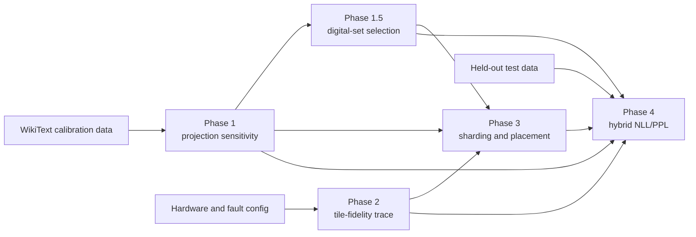

# Hybrid GPT-2 × AIHWKit × Heterogeneous 3D-CIM Pipeline

This repository studies a hybrid digital/analog deployment of GPT-2 Small on a
heterogeneous tile-and-tier compute-in-memory substrate. It profiles which model
projections are most sensitive to analog weight noise, selects a digital
protection frontier, generates time-varying tile fidelity, compares static
placement policies, and measures held-out language-model quality through
AIHWKit.

The repository is an experiment framework, not a collection of committed
benchmark results. Generated data lives under `data/`; most result directories
are not covered by `.gitignore`, so review them explicitly before committing.

## Pipeline



| Stage | Question | Main entry point | Detailed guide |
| --- | --- | --- | --- |
| Phase 1 | Which GPT-2 projections are most sensitive to normalized analog weight noise? | `experiments/phase1_sensitivity/run_aihwkit_profiling.py` | [Phase 1](docs/PHASE_1.md) |
| Phase 1.5 | Which projections should remain digital under cost and capacity constraints? | `experiments/phase1_5_digital_selection/` | [Phase 1.5](docs/PHASE_1_5.md) |
| Phase 2 | How does tile-level noise evolve under heterogeneity, drift, thermal variation, and localized faults? | `experiments/phase2_fidelity/run_fidelity_model.py` | [Phase 2](docs/PHASE_2.md) |
| Phase 3 | How should analog shards be assigned to physical tile/tier slots? | `experiments/phase3_baselines/run_baseline_mappings.py` | [Phase 3](docs/PHASE_3.md) |
| Phase 4 | How do the digital frontier and placement policy affect held-out NLL/PPL? | `experiments/phase4_quality/run_hybrid_quality.py` | [Phase 4](docs/PHASE_4.md) |

## Core experiment contract

The main path uses one shared configuration:

```text
configs/full_pipeline/gpt2_hybrid_3dcim.yaml
```

Its fast counterpart preserves cross-phase structure while reducing blocks,
tokens, timesteps, seeds, and operating points:

```text
configs/full_pipeline/gpt2_hybrid_3dcim_smoke.yaml
```

The executable stages share these rules:

- GPT-2 `Conv1D` weights are converted to canonical `[out, in]` coordinates.
- Each candidate projection is clipped once to a configured multiple of its
  population standard deviation.
- A tile's `noise_std` is dimensionless: it is the logical weight-noise
  standard deviation divided by that projection's programmed range.
- Phase 1 and Phase 4 use the same manual preprocessing and noise
  materialization. AIHWKit's internal programming, read, drift, and forward
  weight noise are disabled to avoid double counting.
- Phase 1's mapping score is mean `delta_nll_noise` relative to that
  projection's clipped nominal analog reference.
- Phase 3 excludes protected digital projections from analog capacity and
  noise, preserves fused Q/K/V row boundaries, and gives one shard to each
  physical tier.
- Phase 4 keeps placements fixed over time and uses paired coordinate-level
  Gaussian fields so placement policies differ only through assigned tile
  scales.

The primary configuration profiles all 48 transformer projections and the tied
language-model head. No projection is hard-coded as digital; measured greedy
selection starts from the all-analog candidate set.

## Installation

Create an isolated Python 3.10+ environment from the repository root:

```bash
python3 -m venv .venv
source .venv/bin/activate
python3 -m pip install --upgrade pip
python3 -m pip install -r requirements.txt
```

The root requirements pin AIHWKit to 1.1.0 and Transformers below 5. Model and
dataset loading uses Hugging Face, so the first run needs network access or a
populated local cache.

AIHWKit contains a native extension. Validate it before downloading data or
starting a long profile:

```bash
python3 scripts/smoke_aihwkit_contract.py --device cpu
```

This checks exact logical-weight write, manual noise installation, readback, and
restoration. For GPU execution, install a compatible CUDA-enabled AIHWKit build
and change `model.device` to `cuda`.

The directories under `simulators/` are upstream reference checkouts with their
own dependencies, licenses, and test suites. The main workflow installs
AIHWKit from `requirements.txt` and does not invoke the bundled IBM 3D-SiM
package. Phase 3 implements the required IBM-style geometry locally.

## Run the smoke pipeline

Start here:

```bash
python3 scripts/run_full_pipeline.py \
  --config configs/full_pipeline/gpt2_hybrid_3dcim_smoke.yaml
```

The smoke configuration is for contract and integration checks, not scientific
reporting. It still loads GPT-2 and WikiText and requires a working AIHWKit
installation.

## Run the full pipeline

Use either entry point:

```bash
python3 scripts/run_full_pipeline.py \
  --config configs/full_pipeline/gpt2_hybrid_3dcim.yaml
```

```bash
bash scripts/run_full_pipeline.sh \
  configs/full_pipeline/gpt2_hybrid_3dcim.yaml
```

The paper-scale configuration is intentionally expensive. Before early
stopping, Phase 1 can require 540 calibration passes, measured Phase 1.5 search
can require up to 524 more, and Phase 4 can require 180 full noisy held-out
passes plus reference evaluations. Use the smoke config to validate the
environment and inspect its artifacts first.

The shell wrapper honors `RUN_PHASE1` through `RUN_PHASE4`. Setting a stage to
`0` only adds the corresponding skip flag; skipped upstream stages still
require their artifact arguments.

## Resume from existing artifacts

The Python driver can reuse any completed upstream stages:

```bash
python3 scripts/run_full_pipeline.py \
  --config configs/full_pipeline/gpt2_hybrid_3dcim.yaml \
  --skip-phase1 \
  --phase1-artifact data/results/phase1_sensitivity/<profile>.json \
  --operating-points-artifact data/results/phase1_5_digital_selection/digital_operating_points.json \
  --skip-phase2 \
  --trace-artifact data/results/phase2_fidelity/fidelity_traces/mixed_96x8/seed_42/trace.npz \
  --skip-phase3 \
  --phase3-manifest data/results/phase3_static_mapping/phase3_manifest.json
```

This validates the reused artifacts and then runs Phase 4. To reuse a Phase 1
profile but regenerate Phase 1.5:

```bash
python3 scripts/run_full_pipeline.py \
  --config configs/full_pipeline/gpt2_hybrid_3dcim.yaml \
  --skip-phase1 \
  --phase1-artifact data/results/phase1_sensitivity/<profile>.json \
  --reselect-digital
```

If Phase 2 or Phase 3 is also skipped, provide its corresponding artifact.
There is no within-stage checkpoint/resume for Phase 1 or measured greedy
selection.

## Multi-seed hardware evaluation

Phase 1 and Phase 1.5 are calibration artifacts and can be reused across
independent hardware traces:

```bash
python3 scripts/run_multiseed_pipeline.py \
  --config configs/full_pipeline/gpt2_hybrid_3dcim.yaml \
  --phase1 data/results/phase1_sensitivity/<profile>.json \
  --operating-points data/results/phase1_5_digital_selection/digital_operating_points.json \
  --trace-seeds 41 42 43 \
  --output-root data/results/multiseed
```

Each seed receives an isolated runtime YAML and Phase 2–4 output tree. The
placement seed remains fixed for paired comparisons unless
`--vary-placement-seed` is supplied. Add `--skip-phase4` to generate only the
traces and placements.

## Default artifacts

| Stage | Main artifacts |
| --- | --- |
| Phase 1 | `data/results/phase1_sensitivity/<timestamped_profile>.json` and `*_ranking.csv` |
| Phase 1.5 | `data/results/phase1_5_digital_selection/digital_operating_points.{json,csv}` and `greedy_marginal_points.{json,csv}` |
| Phase 2 | `data/results/phase2_fidelity/fidelity_traces/<scenario>/seed_<seed>/trace.npz`, `metadata.json`, and `timestep_summary.csv` |
| Phase 3 | `data/results/phase3_static_mapping/phase3_manifest.json`, `phase3_summary.csv`, and per-point placement CSVs |
| Phase 4 | `data/results/phase4_hybrid_quality/hybrid_quality_by_policy.csv`, `nominal_hybrid_frontier.csv`, summaries, and `phase4_metadata.json` |

Major artifacts record upstream paths and provenance such as the configuration
hash and repository commit. Keep the exact Phase 1 profile, operating-point
file, trace, and Phase 3 manifest used for every reported Phase 4 result.

## Validate and test

The full driver runs cross-phase validation automatically after Phase 3. For
existing artifacts, use:

```bash
python3 scripts/validate_pipeline_contracts.py \
  --config <config.yaml> \
  --phase1 <phase1.json> \
  --operating-points <digital_operating_points.json> \
  --trace <trace.npz> \
  --phase3-manifest <phase3_manifest.json>
```

Run only the root project tests; broad repository-wide collection also enters
the bundled simulator suites:

```bash
python3 -m pytest -q tests
```

The dependency-light structural subset is:

```bash
python3 -m pytest -q \
  tests/test_automatic_selection_config.py \
  tests/test_digital_selection.py \
  tests/test_fidelity.py \
  tests/test_sharding_and_mapping.py
```

Phase 4 also provides an artifact-backed zero-noise and uniform-noise invariance
check; see [the Phase 4 guide](docs/PHASE_4.md#sanity-checks).

## Repository layout

```text
configs/
  full_pipeline/              Canonical runnable configurations
  phase*/                     Older per-phase snapshots and placeholders
docs/                         Phase-by-phase methodology and artifact guides
experiments/                  Executable stage entry points
scripts/                      Orchestration, reuse, validation, and smoke tools
src/
  common/                     Dataset, metrics, projection, and analog contracts
  profilers/                  Phase 1 sensitivity implementation
  simulators/                 Tile-fidelity model
  mapping/                    Digital selection, sharding, placement, objectives
  evaluation/                 Hybrid conversion and coordinate noise injection
  analysis/                   Pareto and correlation helpers
tests/                        Root structural and contract tests
simulators/                   Upstream AIHWKit and IBM 3D-SiM reference trees
```

## Configuration status

The two files under `configs/full_pipeline/` are the supported inputs for the
current Phase 1–4 runners.

Several standalone per-phase files predate the unified schema:

- `configs/phase1_sensitivity/lammie_2026.yaml` lacks the current `analog` and
  `phase1` sections;
- four named Phase 2 scenario YAMLs are empty, while `mixed.yaml` uses a legacy
  nesting;
- `configs/phase3_baselines/default.yaml` and
  `configs/phase4_quality/default.yaml` target older runner schemas.

Treat those files as research history or placeholders, not drop-in commands.
The detailed phase guides identify the current fields and known no-op or legacy
settings.

## Modeling boundaries

- The fidelity trace is phenomenological. Timesteps, thermal states, and fault
  severities are normalized simulation quantities rather than calibrated
  physical time or temperature.
- Every tier on one tile shares a tile-level noise scale.
- Phase 3 is capacity-aware but does not run IBM 3D-SiM, model communication,
  or report latency/energy.
- Phase 4 performs static-placement quality evaluation. It does not dynamically
  remap after drift or faults.
- Later-unavailable tiles are represented by a configured high noise scale,
  not by zero output, digital fallback, or infeasibility.
- Digital parameter and MAC fractions are relative to the profiled projection
  candidate universe, not the entire GPT-2 model.
- The language-model head is tied to the token embedding. Logical execution
  cost includes it, while incremental digital storage excludes a duplicate
  tied-weight copy.

These boundaries are deliberate parts of the current experiment definition and
should accompany any interpretation of the generated results.
