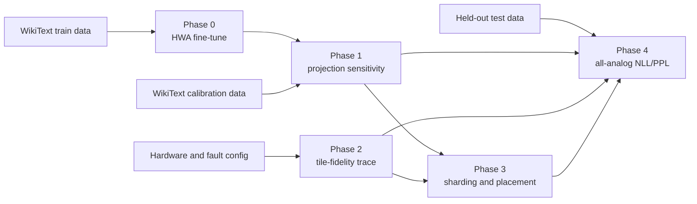

# All-Analog GPT-2 on a Heterogeneous 3D-CIM Substrate

This repository studies an all-analog deployment of GPT-2 Small on a
heterogeneous tile-and-tier compute-in-memory substrate. It fine-tunes the
model under the deployment noise model (hardware-aware training), profiles
which projections are most sensitive to analog weight noise, generates
time-varying tile fidelity, compares static placement policies, and measures
held-out language-model quality through AIHWKit.

The central claim under study: **for a hardware-aware-trained GPT-2 deployed
fully on analog CIM tiles, projection-sensitivity-aware placement preserves
language-model quality better than random, sequential, and hardware-only
placement as heterogeneous tiles degrade.**

The repository is an experiment framework, not a collection of committed
benchmark results. Generated data lives under `data/`.

## Pipeline


```mermaid
flowchart LR
    W[WikiText train data] --> P0[Phase 0<br/>HWA fine-tune]
    P0 --> P1[Phase 1<br/>projection sensitivity]
    C[WikiText calibration data] --> P1
    H[Hardware and fault config] --> P2[Phase 2<br/>tile-fidelity trace]
    P1 --> P3[Phase 3<br/>sharding and placement]
    P2 --> P3
    T[Held-out test data] --> P4[Phase 4<br/>all-analog NLL/PPL]
    P1 --> P4
    P2 --> P4
    P3 --> P4
```

| Stage | Question | Main entry point | Detailed guide |
| --- | --- | --- | --- |
| Phase 0 | How much all-analog quality does noise-aware fine-tuning recover before deployment? | `experiments/phase0_hwa_training/run_hwa_training.py` | [Phase 0](docs/PHASE_0.md) |
| Phase 1 | Which GPT-2 projections are most sensitive to normalized analog weight noise? | `experiments/phase1_sensitivity/run_aihwkit_profiling.py` | [Phase 1](docs/PHASE_1.md) |
| Phase 2 | How does tile-level noise evolve under heterogeneity, drift, thermal variation, and localized faults? | `experiments/phase2_fidelity/run_fidelity_model.py` | [Phase 2](docs/PHASE_2.md) |
| Phase 3 | How should analog shards be assigned to physical tile/tier slots? | `experiments/phase3_baselines/run_baseline_mappings.py` | [Phase 3](docs/PHASE_3.md) |
| Phase 4 | How does the placement policy affect held-out NLL/PPL as tiles degrade? | `experiments/phase4_quality/run_hybrid_quality.py` | [Phase 4](docs/PHASE_4.md) |

### HWA versus PTQ

The primary configuration fine-tunes the model under the deployment noise
model first (Phase 0) and points `model.checkpoint` at the result; every
later phase loads that checkpoint. The post-training (PTQ) contrast — the
same pipeline on pretrained weights — uses `hwa_training.enabled: false` and
`model.checkpoint: null`. Keep the two artifact trees separate and report
them side by side. For Colab execution see [the Colab runbook](docs/COLAB.md).

## Core experiment contract

The canonical configuration is `configs/full_pipeline/gpt2_hybrid_3dcim.yaml`;
its fast counterpart `gpt2_hybrid_3dcim_smoke.yaml` preserves cross-phase
structure for contract checks. For the paper runs, only `experiment.seed`
changes between hardware traces.

The executable stages share these rules:

- GPT-2 `Conv1D` weights are converted to canonical `[out, in]` coordinates.
- Each projection is clipped once to `analog.clip_sigma` population standard
  deviations; a tile's `noise_std` is the logical weight-noise standard
  deviation divided by that projection's programmed range.
- Phase 0 trains with the same clip-and-noise model applied at forward time
  (perturb-forward/clean-update); Phases 1 and 4 use identical manual
  preprocessing and noise materialization with AIHWKit's internal noise
  sources disabled.
- Phase 1's mapping score is mean `delta_nll_noise` relative to that
  projection's clipped nominal analog reference.
- Phase 3 deploys every profiled projection as analog, preserves fused Q/K/V
  row boundaries, and gives one shard to each physical tier.
- Phase 4 keeps placements fixed over time and uses paired coordinate-level
  Gaussian fields so placement policies differ only through assigned tile
  scales.

## Installation

Create an isolated Python 3.10+ environment from the repository root:

```bash
python3 -m venv .venv
source .venv/bin/activate
python3 -m pip install --upgrade pip
python3 -m pip install -r requirements.txt
```

The root requirements pin AIHWKit to 1.1.0 and Transformers below 5. Model
and dataset loading uses Hugging Face, so the first run needs network access
or a populated local cache. Validate the native extension before a long run:

```bash
python3 scripts/smoke_aihwkit_contract.py --device cpu
```

## Run the pipeline

Smoke first, then the paper configuration:

```bash
python3 scripts/run_full_pipeline.py \
  --config configs/full_pipeline/gpt2_hybrid_3dcim_smoke.yaml
```

```bash
python3 scripts/run_full_pipeline.py \
  --config configs/full_pipeline/gpt2_hybrid_3dcim.yaml
```

The paper configuration is expensive: Phase 0 performs up to
2,000 optimizer steps, Phase 1 requires 540 calibration passes, and Phase 4
performs 75 noisy held-out passes (5 timesteps × 3 realizations ×
5 policies) plus reference evaluations.

## Resume from existing artifacts

```bash
python3 scripts/run_full_pipeline.py \
  --config configs/full_pipeline/gpt2_hybrid_3dcim.yaml \
  --skip-phase0 \
  --skip-phase1 \
  --phase1-artifact data/results/phase1_sensitivity/<profile>.json \
  --skip-phase2 \
  --trace-artifact data/results/phase2_fidelity/fidelity_traces/mixed_96x8/seed_42/trace.npz \
  --skip-phase3 \
  --phase3-manifest data/results/phase3_static_mapping/phase3_manifest.json
```

Phase 0 auto-resumes from its newest step checkpoint; Phase 4 resumes from
its per-timestep partial CSV. A skipped Phase 0 requires the configured
`model.checkpoint` directory to exist.

## Multi-seed hardware evaluation

Phases 0 and 1 are calibration artifacts reused across independent hardware
traces:

```bash
python3 scripts/run_multiseed_pipeline.py \
  --config configs/full_pipeline/gpt2_hybrid_3dcim.yaml \
  --phase1 data/results/phase1_sensitivity/<profile>.json \
  --trace-seeds 41 43 44 45 \
  --vary-placement-seed \
  --output-root data/results/multiseed
```

Then aggregate across traces — within-trace bootstrap intervals in
`paired_policy_summary.csv` are descriptive (the timestep/realization samples
share one correlated trace); the inferential paper numbers treat each trace
seed as one statistical unit:

```bash
python3 scripts/aggregate_multiseed.py \
  --manifest data/results/multiseed/multiseed_run_manifest.yaml
```

## Default artifacts

| Stage | Main artifacts |
| --- | --- |
| Phase 0 | `data/results/phase0_hwa_training/<model>/checkpoint_final/` and `hwa_metadata.json` |
| Phase 1 | `data/results/phase1_sensitivity/<timestamped_profile>.json` and `*_ranking.csv` |
| Phase 2 | `fidelity_traces/<scenario>/seed_<seed>/trace.npz`, `metadata.json`, `timestep_summary.csv` |
| Phase 3 | `phase3_manifest.json`, `phase3_summary.csv`, per-policy placement CSVs |
| Phase 4 | `hybrid_quality_by_policy.csv`, `nominal_reference.json`, `hybrid_quality_summary.csv`, `paired_policy_summary.csv`, `phase4_metadata.json` |
| Cross-trace | `cross_trace_paired_summary.csv` |

Major artifacts record upstream paths and provenance (configuration hash,
repository commit, resolved model source).

## Validate and test

Cross-phase validation runs automatically after Phase 3; for existing
artifacts use `scripts/validate_pipeline_contracts.py`. Run the root project
tests only (broad collection would enter the vendored simulator suites):

```bash
python3 -m pytest -q tests
```

Phase 4 also provides zero-noise and uniform-noise invariance checks; see
[the Phase 4 guide](docs/PHASE_4.md#sanity-checks).

## Repository layout

```text
configs/full_pipeline/        Canonical + smoke configurations
docs/                         Phase-by-phase methodology and artifact guides
experiments/                  Executable stage entry points
notebooks/                    Colab phase-selector notebook
scripts/                      Orchestration, multiseed, aggregation, validation
src/
  common/                     Dataset, metrics, projection, analog, loader
  training/                   Phase 0 noise-injection wrappers
  profilers/                  Phase 1 sensitivity implementation
  simulators/                 Tile-fidelity model
  mapping/                    Sharding, placement policies, objectives
  evaluation/                 Hybrid conversion and coordinate noise injection
  analysis/                   Pareto and rank-correlation helpers
tests/                        Structural and contract tests
simulators/                   Upstream IBM 3D-SiM reference (submodule)
```

## Modeling boundaries

- The fidelity trace is phenomenological; its parameters are
  literature-motivated scenario values, not device-calibrated quantities
  ([Phase 2 provenance](docs/PHASE_2.md#parameter-provenance)).
- Every tier on one tile shares a tile-level noise scale.
- Phase 3 is capacity-aware but does not model communication, latency, or
  energy.
- Phase 4 performs static-placement quality evaluation; placements are not
  remapped after drift or faults, and later-unavailable tiles are represented
  by a configured high noise scale.
- The language-model head is tied to the token embedding; the analog LM-head
  copy is noisy while the embedding lookup stays exact, in training and in
  deployment alike.

These boundaries are deliberate parts of the experiment definition and should
accompany any interpretation of the generated results.
