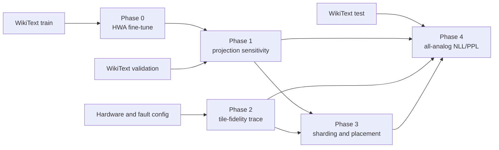

# Sensitivity-Aware Placement for All-Analog GPT-2 on Aging In-Memory Tiles

Code for the IEEE CAL letter *"Sensitivity-Aware Placement Sustains All-Analog
GPT-2 Inference on Aging In-Memory Tiles"*. GPT-2 Small is fine-tuned under a
documented analog noise contract (hardware-aware training), each of its 49
weight projections is profiled for noise sensitivity, and the resulting shard
placement onto a heterogeneous, aging tile-and-tier substrate is compared
against workload-blind placements on the full WikiText-103 test set through
IBM's AIHWKit.

Claim under study: for a hardware-aware-trained GPT-2 with every weight
projection on analog tiles, sensitivity-aware placement holds language-model
quality better than random, sequential, and hardware-only placement as
heterogeneous tiles degrade.

This repository holds the code, configurations, the Colab workflow, and the
small derived tables/figure data cited by the paper (`paper/data`). Raw
experiment outputs (checkpoints, traces, per-condition evaluations) live on
Google Drive and are not committed.

## Pipeline


```mermaid
flowchart LR
    W[WikiText train] --> P0[Phase 0<br/>HWA fine-tune]
    P0 --> P1[Phase 1<br/>projection sensitivity]
    C[WikiText validation] --> P1
    H[Hardware and fault config] --> P2[Phase 2<br/>tile-fidelity trace]
    P1 --> P3[Phase 3<br/>sharding and placement]
    P2 --> P3
    T[WikiText test] --> P4[Phase 4<br/>all-analog NLL/PPL]
    P1 --> P4
    P2 --> P4
    P3 --> P4
```

| Stage | Question | Entry point | Guide |
| --- | --- | --- | --- |
| Phase 0 | Make the all-analog deployment functional (noise-injection fine-tuning) | `experiments/phase0_hwa_training/run_hwa_training.py` | [docs/PHASE_0.md](docs/PHASE_0.md) |
| Phase 1 | Which projections are most sensitive to analog weight noise? | `experiments/phase1_sensitivity/run_aihwkit_profiling.py` | [docs/PHASE_1.md](docs/PHASE_1.md) |
| Phase 1 check | Is the one-at-a-time profile rank-stable with all 49 projections noisy? | `experiments/phase1_sensitivity/run_leave_one_out.py` | [docs/PHASE_1.md](docs/PHASE_1.md#leave-one-out-check-rank-stability-of-the-additive-profile) |
| Phase 2 | How does tile noise evolve (heterogeneity, drift, thermal variation, faults)? | `experiments/phase2_fidelity/run_fidelity_model.py` | [docs/PHASE_2.md](docs/PHASE_2.md) |
| Phase 3 | How are analog shards assigned to tile/tier slots under each policy? | `experiments/phase3_baselines/run_baseline_mappings.py` | [docs/PHASE_3.md](docs/PHASE_3.md) |
| Phase 4 | How does each placement age on the held-out test set? | `experiments/phase4_quality/run_hybrid_quality.py` | [docs/PHASE_4.md](docs/PHASE_4.md) |
| Hybrid comparator | LM head / top-2 projections digital, remainder analog | `experiments/phase4_quality/run_hybrid_baselines.py` | [docs/PHASE_4.md](docs/PHASE_4.md#digitalanalog-hybrid-comparator) |

## Experiment contract

The canonical configuration is `configs/full_pipeline/gpt2_hybrid_3dcim.yaml`
(`gpt2_hybrid_3dcim_smoke.yaml` is its fast structural counterpart); only
`experiment.seed` changes between hardware traces. Shared rules:

- GPT-2 `Conv1D` weights are handled in canonical `[out, in]` coordinates.
- Each projection is clipped once at `analog.clip_sigma` population standard
  deviations; tile `noise_std` is the logical weight-noise standard deviation
  as a fraction of the projection's programmed (peak-to-peak) range.
- Phase 0 trains through the same clip-and-noise model (perturb-forward /
  clean-update); Phases 1 and 4 use identical preprocessing and noise
  materialization with AIHWKit's internal noise sources disabled.
- Phase 3 places every profiled projection on analog tiers, one shard per tier,
  preserving fused Q/K/V row boundaries.
- Phase 4 keeps placements fixed over time and uses paired coordinate-level
  Gaussian fields, so policies differ only through their assigned tile scales.

## Installation

```bash
python3 -m venv .venv && source .venv/bin/activate
python3 -m pip install --upgrade pip
python3 -m pip install -r requirements.txt
python3 scripts/smoke_aihwkit_contract.py --device cpu   # checks the AIHWKit native extension
```

Requirements pin `aihwkit==1.1.0` and `transformers<5`; models and datasets are
fetched from the Hugging Face Hub on first use.

## Running

Single trace (smoke first, then the paper configuration):

```bash
python3 scripts/run_full_pipeline.py --config configs/full_pipeline/gpt2_hybrid_3dcim_smoke.yaml
python3 scripts/run_full_pipeline.py --config configs/full_pipeline/gpt2_hybrid_3dcim.yaml
```

Phase 0 resumes from its newest step checkpoint and Phase 4 from its
per-timestep partial CSV; `--skip-phase*` and `--*-artifact` flags reuse
existing artifacts (see `scripts/run_full_pipeline.py --help`).

Independent hardware traces reuse the Phase-0 checkpoint and Phase-1 profile,
and are aggregated with each trace as one statistical unit:

```bash
python3 scripts/run_multiseed_pipeline.py --config configs/full_pipeline/gpt2_hybrid_3dcim.yaml \
  --phase1 <profile>.json --trace-seeds 41 43 44 45 --vary-placement-seed --output-root <root>/multiseed
python3 scripts/aggregate_multiseed.py --manifest <root>/multiseed/multiseed_run_manifest.yaml
```

The additive experiments of the paper — placement bounds
(`configs/full_pipeline/gpt2_allanalog_bounds.yaml`), the one-factor Phase-2
sweep (`configs/phase2_sweep/`), the leave-one-out check, and the hybrid
comparator (`scripts/run_hybrid_baselines_multiseed.py`) — are driven by the
Colab notebook `notebooks/projection_sensitivity_mapping.ipynb`
([docs/COLAB.md](docs/COLAB.md)). Phases 1 and 4 need a GPU; every long step
checkpoints to Drive and resumes.

## Tests and validation

```bash
python3 -m pytest -q tests
python3 scripts/validate_pipeline_contracts.py --help   # cross-phase contract checks (run automatically after Phase 3)
```

## Repository layout

```text
configs/          canonical, smoke, bounds, GPT-2 Medium and Phase-2 sweep configurations
docs/             phase guides, Colab runbook, shared references
experiments/      executable phase entry points
notebooks/        Colab phase-selector notebook
paper/            letter source (main.tex), figures, figure scripts, cited data tables
scripts/          pipeline drivers, multiseed/aggregation, hybrid campaign, validation
src/common        dataset windows, metrics, projection handles, analog settings, loaders
src/training      Phase-0 noise-injection wrappers
src/profilers     Phase-1 sensitivity and leave-one-out profilers
src/simulators    tile-fidelity trace model
src/mapping       sharding, placement policies, proxy objectives
src/evaluation    hybrid analog conversion, paired noise materialization, hybrid designs
tests/            structural and contract tests
```

## Modeling boundaries

- The tile-fidelity trace is phenomenological: literature-motivated scenario
  values, not device-calibrated quantities ([Phase 2 provenance](docs/PHASE_2.md#parameter-provenance)).
- All tiers of one tile share one noise scale; placements are static (no
  remapping after drift or faults).
- Capacity is tier-granular; communication, latency, and energy are not modeled.
- The analog LM-head copy is noisy while the tied embedding lookup stays exact,
  in training and deployment alike.
